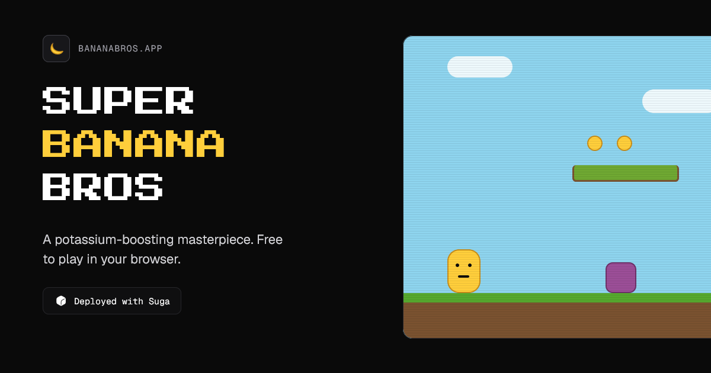

# 🍌 Super Banana Bros



A potassium-boosting masterpiece. A Mario-style platformer starring a banana, across three themed worlds (Grass, Ice, Fire). Built with TanStack Start + Kaplay, deployed with Suga.

## Local development

```bash
bun install
docker compose up -d      # Redis for the leaderboard
bun run dev               # http://localhost:3000
```

The app reads `REDIS_URL` (default `redis://localhost:6379`). If Redis isn't
running the game still works — the leaderboard just shows empty and score
submissions are skipped.

Build / run production:

```bash
bun run build             # outputs .output/server/index.mjs
bun run start             # node .output/server/index.mjs
```

## Leaderboard

Scores persist in a **Redis sorted set** (`leaderboard:banana-bros`) via TanStack
Start server functions in `src/lib/leaderboard.ts` — each run is an independent
entry (top 100 kept) and initials are profanity-filtered server-side.

> ⚠️ **Scores are unauthenticated.** Initials are just a label and the score is
> submitted by the client, so anyone can post any score. It's a fun arcade
> board, not a competitive ranking.

## Deploying to Suga

The app runs on [Suga](https://suga.app) as a container talking to a Redis
container over private networking. Suga is provisioned via its MCP/UI — **not**
from `compose.yaml` (that file is for local dev and for visualizing the topology
in-source).

Paste this to an agent that has the Suga MCP connected:

```text
Using the Suga MCP, wire up the super-banana-bros project's `production` environment:

1. App container "banana-bros": builds from davemooreuws/super-banana-bros @ main
   with sugapack (auto-detect, no Dockerfile), start command
   `node .output/server/index.mjs`, listening on 3000 (public HTTPS + private 3000).
2. Add a "redis" container: image redis:7-alpine, command
   `redis-server --appendonly yes`, private-only port 6379, private hostname "redis".
3. Add a volume mounted at /data on the redis container (AOF persistence).
4. Set env var REDIS_URL on banana-bros to
   redis://{{<redis-resource-id>.networking.private.hostname}}:6379
   (use redis's resource id from get_draft).
5. Return the review-draft deeplink so I can deploy.
```

## Styling

This project uses [Tailwind CSS](https://tailwindcss.com/) for styling.

### Removing Tailwind CSS

If you prefer not to use Tailwind CSS:

1. Remove the demo pages in `src/routes/demo/`
2. Replace the Tailwind import in `src/styles.css` with your own styles
3. Remove `tailwindcss()` from the plugins array in `vite.config.ts`
4. Remove `@tailwindcss/vite` and `tailwindcss` from `package.json`

## Linting & Formatting

This project uses [Biome](https://biomejs.dev/) for linting and formatting. The following scripts are available:


```bash
bun --bun run lint
bun --bun run format
bun --bun run check
```


## Routing

This project uses [TanStack Router](https://tanstack.com/router) with file-based routing. Routes are managed as files in `src/routes`.

### Adding A Route

To add a new route to your application just add a new file in the `./src/routes` directory.

TanStack will automatically generate the content of the route file for you.

Now that you have two routes you can use a `Link` component to navigate between them.

### Adding Links

To use SPA (Single Page Application) navigation you will need to import the `Link` component from `@tanstack/react-router`.

```tsx
import { Link } from "@tanstack/react-router";
```

Then anywhere in your JSX you can use it like so:

```tsx
<Link to="/about">About</Link>
```

This will create a link that will navigate to the `/about` route.

More information on the `Link` component can be found in the [Link documentation](https://tanstack.com/router/v1/docs/framework/react/api/router/linkComponent).

### Using A Layout

In the File Based Routing setup the layout is located in `src/routes/__root.tsx`. Anything you add to the root route will appear in all the routes. The route content will appear in the JSX where you render `{children}` in the `shellComponent`.

Here is an example layout that includes a header:

```tsx
import { HeadContent, Scripts, createRootRoute } from '@tanstack/react-router'

export const Route = createRootRoute({
  head: () => ({
    meta: [
      { charSet: 'utf-8' },
      { name: 'viewport', content: 'width=device-width, initial-scale=1' },
      { title: 'My App' },
    ],
  }),
  shellComponent: ({ children }) => (
    <html lang="en">
      <head>
        <HeadContent />
      </head>
      <body>
        <header>
          <nav>
            <Link to="/">Home</Link>
            <Link to="/about">About</Link>
          </nav>
        </header>
        {children}
        <Scripts />
      </body>
    </html>
  ),
})
```

More information on layouts can be found in the [Layouts documentation](https://tanstack.com/router/latest/docs/framework/react/guide/routing-concepts#layouts).

## Server Functions

TanStack Start provides server functions that allow you to write server-side code that seamlessly integrates with your client components.

```tsx
import { createServerFn } from '@tanstack/react-start'

const getServerTime = createServerFn({
  method: 'GET',
}).handler(async () => {
  return new Date().toISOString()
})

// Use in a component
function MyComponent() {
  const [time, setTime] = useState('')
  
  useEffect(() => {
    getServerTime().then(setTime)
  }, [])
  
  return <div>Server time: {time}</div>
}
```

## API Routes

You can create API routes by using the `server` property in your route definitions:

```tsx
import { createFileRoute } from '@tanstack/react-router'
import { json } from '@tanstack/react-start'

export const Route = createFileRoute('/api/hello')({
  server: {
    handlers: {
      GET: () => json({ message: 'Hello, World!' }),
    },
  },
})
```

## Data Fetching

There are multiple ways to fetch data in your application. You can use TanStack Query to fetch data from a server. But you can also use the `loader` functionality built into TanStack Router to load the data for a route before it's rendered.

For example:

```tsx
import { createFileRoute } from '@tanstack/react-router'

export const Route = createFileRoute('/people')({
  loader: async () => {
    const response = await fetch('https://swapi.dev/api/people')
    return response.json()
  },
  component: PeopleComponent,
})

function PeopleComponent() {
  const data = Route.useLoaderData()
  return (
    <ul>
      {data.results.map((person) => (
        <li key={person.name}>{person.name}</li>
      ))}
    </ul>
  )
}
```

Loaders simplify your data fetching logic dramatically. Check out more information in the [Loader documentation](https://tanstack.com/router/latest/docs/framework/react/guide/data-loading#loader-parameters).


# Learn More

You can learn more about all of the offerings from TanStack in the [TanStack documentation](https://tanstack.com).

For TanStack Start specific documentation, visit [TanStack Start](https://tanstack.com/start).
